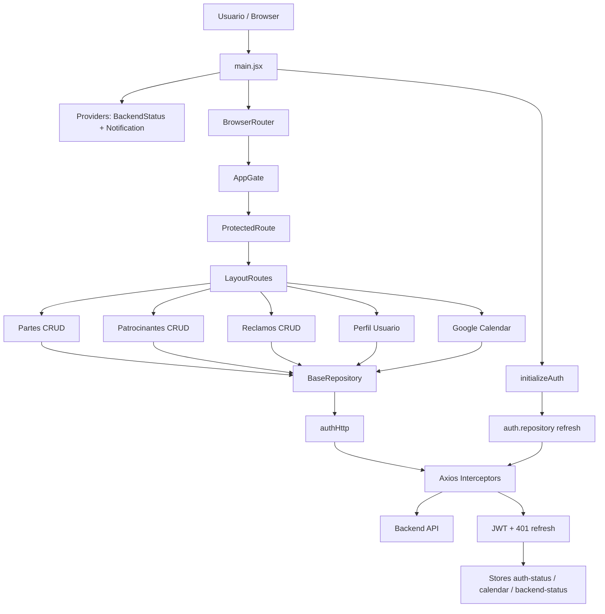

# 01. Arquitectura

## 1) Stack y base tecnológica

Este proyecto es un cliente web SPA de React 19 construido con Vite. La arquitectura es orientada a un flujo de negocio administrativo con autenticación, listados paginados, formularios de mantenimiento y generación documental (actas, PDF, Google Calendar).

### Tecnologías principales

- Frontend: React 19 + Vite
- Enrutamiento: `react-router-dom` v7
- UI: Bootstrap 5 + CSS modular local
- Formularios y edición de contenido: `@tiptap/*`, `pdfmake`, `dompurify`
- Networking: `axios`
- Estado local: stores simples en módulos + contextos React
- Notificaciones: `react-toastify`
- Utilidades: `dayjs`, `date-fns`, `driver.js`
- Test: `vitest` + `@testing-library/react` + `@testing-library/jest-dom`
- Lint: ESLint + plugin React + React Hooks + Prettier

## 2) Estructura del proyecto

```text
rivendel-client/
├─ docs/                                  # Documentación técnica
├─ public/                                # Assets estáticos
├─ src/
│  ├─ api/                                # HTTP / repositorios
│  │  ├─ repositories/                   # Entidades: partes, patrocinantes, reclamos, users, health, calendar
│  │  ├─ auth.repository.js              # Login, refresh, logout
│  │  ├─ constants.js                   # Configuración global de backend
│  │  ├─ http.js                        # Instancias axios authHttp/publicHttp
│  │  ├─ interceptors.js                # JWT + refresh + backend status
│  │  └─ *.test.js                     # Pruebas API/repository
│  ├─ auth/                              # Inicialización y sesión
│  │  ├─ auth.bootstrap.js              # bootstrap auth al iniciar app
│  │  ├─ auth.service.js                 # Guarda/limpia token y perfil
│  │  └─ *.test.js
│  ├─ components/
│  │  ├─ AppGate/                       # Estado del backend
│  │  ├─ Auth/                          # Protecciones de rutas
│  │  ├─ ClausulasAcuerdo/              # Editor de cláusulas y plantillas
│  │  ├─ GoogleCalendar/                # Conexión OAuth de Google Calendar
│  │  ├─ Grid/                          # Listados y paginación reutilizable
│  │  ├─ Layout/                        # Shell, nav, tour inicial
│  │  ├─ Login/                         # Form login y handlers
│  │  ├─ Partes/                        # CRUD de partes
│  │  ├─ Patrocinantes/                 # CRUD de patrocinantes
│  │  ├─ Reclamos/                      # CRUD y actas de reclamos
│  │  ├─ SearchDialog/                  # Búsquedas generales
│  │  ├─ Shared/                       # Sobres, iconos, validación, layout base
│  │  └─ Users/                        # Perfil de usuario
│  ├─ contexts/
│  │  ├─ Constants.jsx                  # Contextos globales
│  │  ├─ BackendStatusProvider.jsx      # Estado del backend
│  │  └─ NotificationProvider.jsx       # Toast centralizado
│  ├─ dtos/
│  │  ├─ token.js                       # Token en memoria
│  │  └─ userName.js                    # Nombre de usuario en memoria
│  ├─ stores/
│  │  ├─ auth-status.js                 # Estado autenticado
│  │  ├─ auth-resolution.js             # Resolución inicial de auth
│  │  ├─ backend-status.js             # Estado del servidor
│  │  ├─ calendar.js                   # Estado de Google Calendar
│  │  └─ *.test.js
│  ├─ utils/
│  │  └─ navigation.js                  # Navegación segura para redirects
│  ├─ App.jsx                          # Entrada principal de login
│  ├─ main.jsx                         # Bootstrap de la app y rutas
│  ├─ setupTests.js                    # Configuración global de tests
│  └─ index.css                        # CSS global
├─ .env.local / .env.production         # Variables de entorno
├─ eslint.config.js                     # ESLint
├─ index.html                           # HTML base de Vite
├─ package.json                         # Scripts y dependencias
├─ pnpm-lock.yaml                       # Lockfile
├─ vite.config.js                       # Config de build y tests
├─ README.md                            # README base de Vite
├─ vercel.json                           # Config de despliegue
└─ test.sh                              # Script de validación del proyecto
```

## 3) Principios de arquitectura

### 3.1 Arquitectura por capas

La aplicación se organiza por responsabilidades bien separadas:

- Capa de acceso a datos: `src/api` y los repositorios respectivos.
- Capa de estado / sesión: `src/stores` y `src/dtos`.
- Capa de composición de vistas: `src/components`.
- Capa de infraestructura del navegador: `src/utils`, `src/contexts`.

### 3.2 Patrones dominantes

- Store en módulo con listeners internos para cambios globales.
- Context API para notificaciones y estado del backend.
- Repositorios con una base común (`BaseRepository`).
- Formularios con reducer local (`useReducer`).
- Componentes reutilizables para grillas, buscadores, validación y notificaciones.

### 3.3 Flujo de datos principal

1. `main.jsx` inicializa:
   - interceptores HTTP
   - bootstrap de autenticación
   - `BrowserRouter`
   - providers globales
2. `initializeAuth()` ejecuta `refresh()` para intentar restaurar sesión.
3. `setAuthData()` guarda token, usuario y estado de conexión a Google Calendar.
4. `ProtectedRoute` y `AppGate` bloquean acceso hasta que la sesión y el backend estén resueltos.
5. Las páginas cargan datos a través de `BaseRepository` y `useApi`.
6. Las acciones CRUD actualizan el backend y refuerzan el estado del UI con toasts y navegación.

## 4) Inicialización y arranque

El arranque de la aplicación se encuentra en `src/main.jsx` y realiza la secuencia siguiente:

```jsx
setupInterceptors();
initializeAuth();
dayjs.locale('es');

root.render(
  <StrictMode>
    <BackendStatusProvider>
      <NotificationProvider>
        <BrowserRouter>
          <PageTitle />
          <NotificationDisplay />
          <AppGate>
            <Routes>
              <Route path="/" element={<App />} />
              <Route element={<ProtectedRoute />}>
                <Route element={<LayoutRoutes />}>
                  ...rutas protegidas...
                </Route>
              </Route>
            </Routes>
          </AppGate>
        </BrowserRouter>
      </NotificationProvider>
    </BackendStatusProvider>
  </StrictMode>
);
```

Los aspectos más relevantes son:

- El sistema de autenticación se resuelve antes de renderizar contenido protegido.
- El `BackendStatusProvider` activa un control de disponibilidad del backend.
- El `NotificationProvider` centraliza mensajes de éxito/error.
- La app usa `PageTitle` para ajustar el título por ruta.

## 5) Autenticación y estado global

### Flujo actual

- `auth.repository.js`: login, refresh y logout hacia el backend.
- `auth.service.js`: escribe token, usuario y estado de sesión.
- `stores/auth-status.js`: booleano de autenticación.
- `stores/auth-resolution.js`: indica cuándo terminó la resolución inicial.
- `dtos/token.js`: sesión en memoria.

### Lógica de seguridad del cliente

- El token se inyecta en el header `Authorization` desde el interceptor request.
- La actualización automática del token se maneja en `interceptors.js` con cola de reintentos.
- En caso de 401, se intenta refresh y se redirige a `/` al fallar.
- El backend se valida con `Health.get()` y el estado global `BACKEND_STATUS_UP/DOWN/ERROR`.

## 6) Integración con APIs y repositorios

La librería `BaseRepository` encapsula la llamada HTTP y normaliza respuestas:

- `request()`: envuelve `authHttp(config)`
- `findAll()`: transforma paginado y totalPages
- `create()`, `update()`, `delete()`, `get()`: operadores CRUD

Cada entidad define su endpoint concreta:

- `Partes`
- `Patrocinantes`
- `Reclamos`
- `Users`
- `GoogleCalendar`
- `Health`

## 7) Diagrama de arquitectura



## 8) Observaciones de diseño

- La app prioriza simplicidad operativa sobre un patrón más pesado de estado global (Redux/Zustand) y usa stores en módulos para un contexto de negocio pequeño.
- La capa de repositorios hace que CRUD y consultas se vuelvan reutilizables.
- El sistema de validación y UI está fuertemente acoplado a componentes por entidad, lo que facilita el desarrollo rápido pero exige disciplina para evitar duplicación de lógica.
- La presencia de `driver.js` y `localStorage` para onboarding sugiere una experiencia guiada y no puramente declarativa.

## 9) Riesgos arquitectónicos detectados

- No hay tipado estático real en la app (mayoría de archivo JS/JSX).
- El estado de sesión se mantiene en memoria de módulo y no se persiste en sessionStorage/localStorage para un control más robusto.
- Las respuestas de API están bastante centralizadas, pero hay lógica de negocio y validación dispersa en componentes.
- No se observa una estrategia de cache HTTP ni un service worker; el sistema depende del backend y de consultas vivas.
- No hay pipeline de CI/CD visible en el repositorio de la rama actual.
